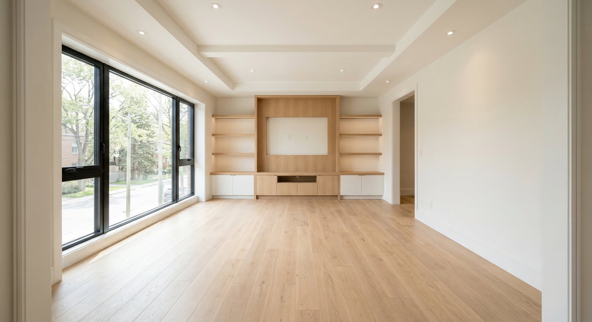
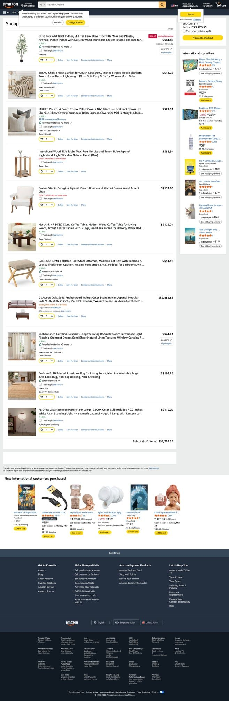
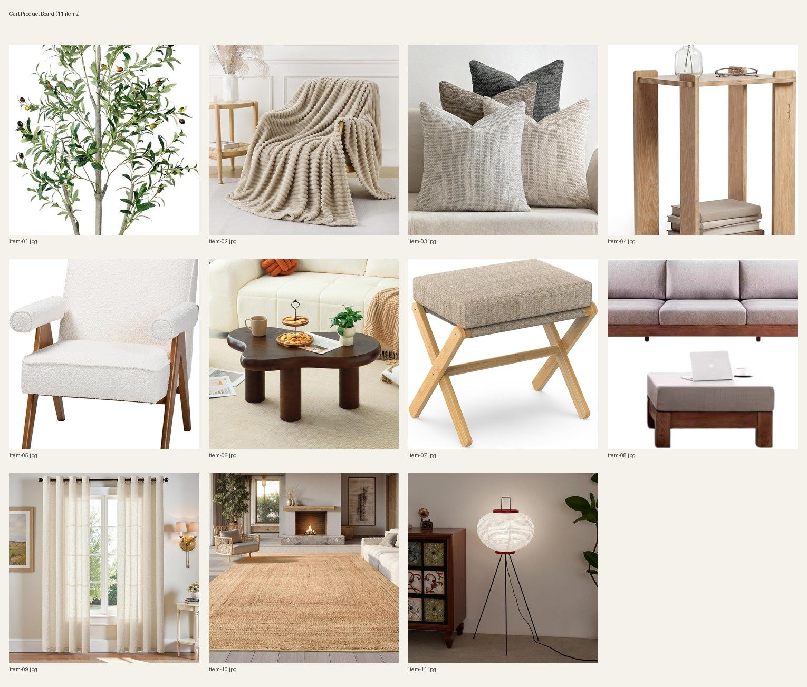
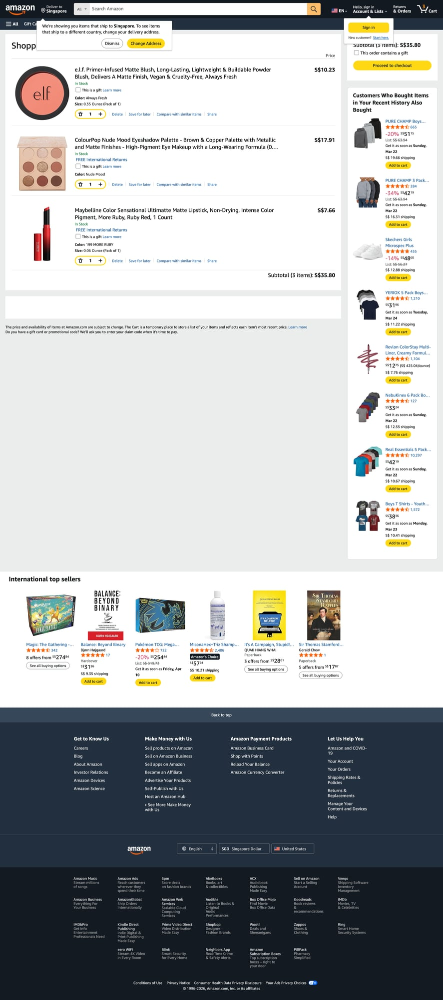
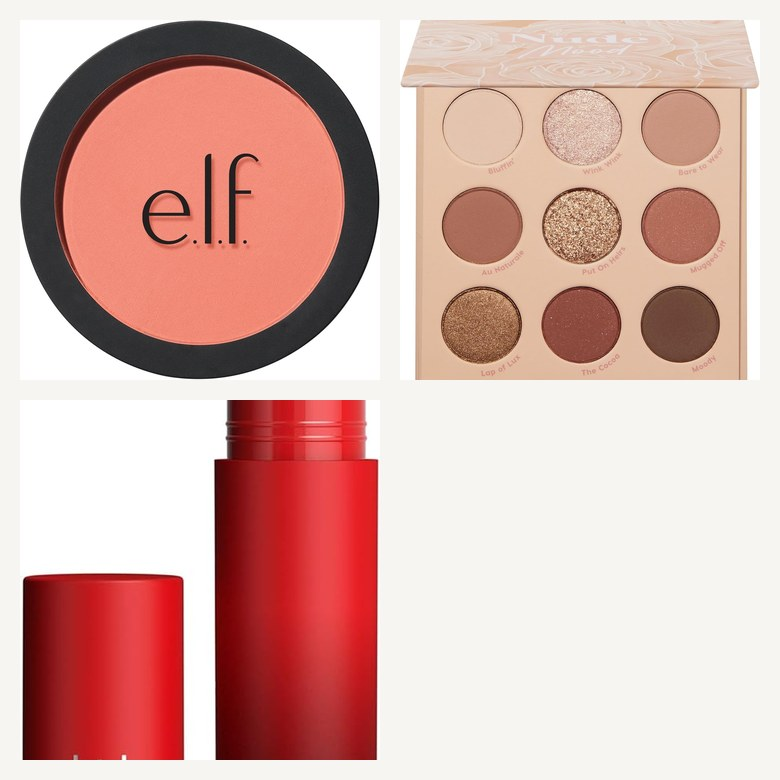
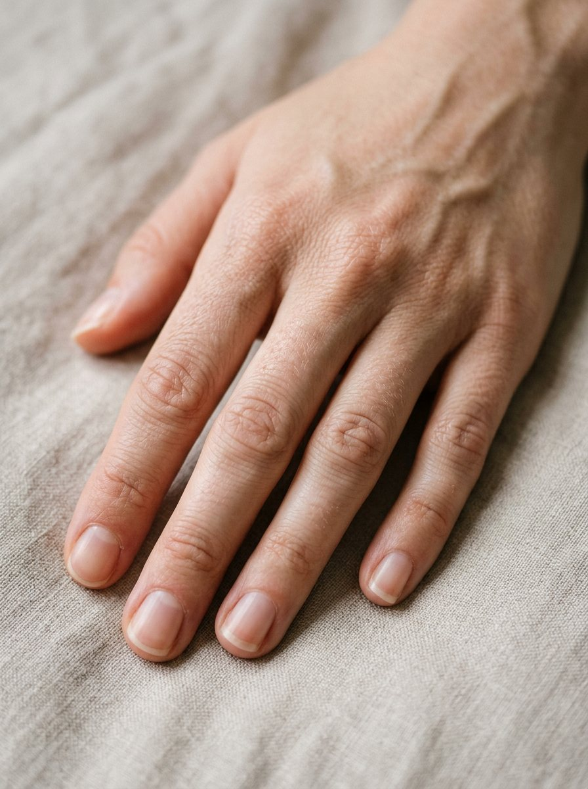
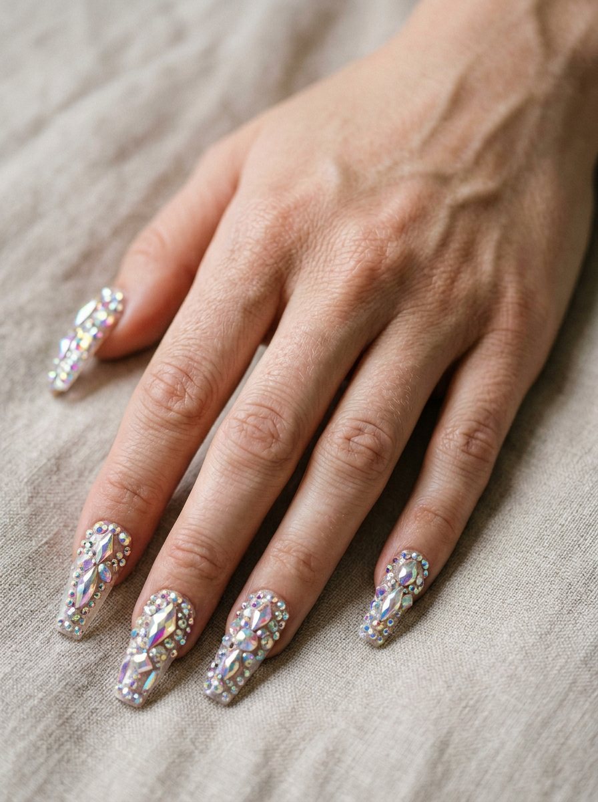
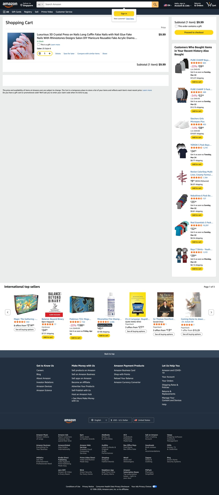
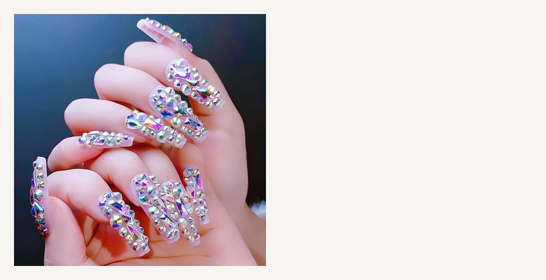

# pic-to-pick

[English](./README.md) | [简体中文](./README.zh-CN.md)

把图片变成可购买的商品组合。

`pic-to-pick` 可以把一张参考图转成购买建议、可直接加入购物车的匹配商品，以及对应的 AI 预览图。

它会理解图片中的空间条件和风格线索，帮助把灵感一路推进到实际购买。

兼容 OpenClaw、Claude Code 和 Codex。

## Examples

### Example 1: 从空房客厅到可购买方案

这个示例从一张空置客厅图片开始，先在 Amazon 构建真实购物车，再基于购物车商品生成受约束的最终预览图。

完整报告： [showcase/example1-success/report-project/REPORT.md](showcase/example1-success/report-project/REPORT.md)

| 平台 | 风格目标 | 购物车商品数 | 购物车总额 |
| --- | --- | --- | --- |
| Amazon | Japandi / 温暖极简 | 11 | S$3,726.55 |

| 分析结果 | 优先购买 |
| --- | --- |
| 空间采光充足，拥有大面积窗户、浅木色地板和内置电视墙。右侧门洞和主要动线需要保持畅通。 | 优先补齐地毯、落地灯和窗帘/百叶。沙发、茶几和软装配件可作为下一阶段采购。 |

<table>
  <tr>
    <th width="50%">原始空间</th>
    <th width="50%">最终预览</th>
  </tr>
  <tr>
    <td>
      
    </td>
    <td>
      
    </td>
  </tr>
</table>

<table>
  <tr>
    <th width="50%">购物车证据</th>
    <th width="50%">商品参考板</th>
  </tr>
  <tr>
    <td align="center">
      
    </td>
    <td align="center">
      
    </td>
  </tr>
</table>

  
购物车金额明细

   

  | # | 商品 | 单价 | 数量 | 小计 |
  | --- | --- | ---: | ---: | ---: |
  | 1 | Olive Trees Artificial Indoor, 5FT Tall Faux Olive Tree wit... | S$84.40 | 1 | S$ 84.40 |
  | 2 | YIICKO Khaki Throw Blanket for Couch Sofa 50x60 inches Stri... | S$12.78 | 1 | S$ 12.78 |
  | 3 | MIULEE Pack of 4 Couch Throw Pillow Covers 18x18 Inch Neutr... | S$23.01 | 1 | S$ 23.01 |
  | 4 | monohomi Wood Side Table, Tool-Free Mortise and Tenon Boho ... | S$63.94 | 1 | S$ 63.94 |
  | 5 | Baxton Studio Georgina Japandi Cream Boucle and Walnut Brow... | S$133.10 | 1 | S$ 133.10 |
  | 6 | Mordchil HF 34"(L) Cloud Coffee Table, Modern Wood Coffee T... | S$179.04 | 1 | S$ 179.04 |
  | 7 | BAMBOOHOMIE Foldable Foot Stool Ottoman, Modern Foot Rest w... | S$51.15 | 1 | S$ 51.15 |
  | 8 | GVAwood Oak, Solid Rubberwood Walnut Color Scandinavian Jap... | S$2,853.38 | 1 | S$ 2,853.38 |
  | 9 | jinchan Linen Curtains 84 Inches Long for Living Room Bedro... | S$44.41 | 1 | S$ 44.41 |
  | 10 | Bedsure 8x10 Printed Jute-Look Rug for Living Room, Machine... | S$166.25 | 1 | S$ 166.25 |
  | 11 | FLIOPIO Japanese Rice Paper Floor Lamp - 3000K Color Bulb I... | S$115.09 | 1 | S$ 115.09 |

  购物车总额：`S$3,726.55`

这个示例展示了：

- 在不改变房间结构和视角的前提下完成软装方案生成。
- 预览图只使用购物车里的真实商品作为参考约束。
- 商品参考板可直接作为生图输入的一部分。
- 报告会补充每个商品的真实金额（单价/数量/小计）以及购物车总金额。

### Example 2: OOTD（日常穿搭）

这个示例从一张 9:16 的儿童全身 mock 图开始，在 Amazon 构建真实购物车，并生成受购物车商品约束的最终穿搭预览图。

完整报告： [showcase/example2-ootd/report-project/REPORT.md](showcase/example2-ootd/report-project/REPORT.md)

| 平台 | 场景 | 购物车商品数 | 购物车总额 |
| --- | --- | --- | --- |
| Amazon | 儿童日常穿搭 OOTD | 7 | S$179.41 |

<table>
  <tr>
    <th width="50%">原始图</th>
    <th width="50%">最终预览</th>
  </tr>
  <tr>
    <td>
      
    </td>
    <td>
      
    </td>
  </tr>
</table>

<table>
  <tr>
    <th width="50%">购物车证据</th>
    <th width="50%">商品参考板</th>
  </tr>
  <tr>
    <td align="center">
      
    </td>
    <td align="center">
      
    </td>
  </tr>
</table>

### Example 3: Beauty（脸部美妆 + 美甲）

这个示例包含两条子流程，标准与 Example 1 一致：
- Amazon 真实购物车加购
- 真实商品图拉取
- 仅基于购物车商品约束生图
- 报告包含每件商品真实金额与总金额

脸部美妆报告： [showcase/example3-beauty-face/report-project/REPORT.md](showcase/example3-beauty-face/report-project/REPORT.md)  
美甲报告： [showcase/example3-beauty-nail/report-project/REPORT.md](showcase/example3-beauty-nail/report-project/REPORT.md)

| 子案例 | 购物车商品数 | 购物车总额 |
| --- | --- | --- |
| 脸部美妆 | 3 | S$35.80 |
| 美甲 | 1 | $9.99 |

#### 脸部美妆

<table>
  <tr>
    <th width="50%">原始图</th>
    <th width="50%">最终预览</th>
  </tr>
  <tr>
    <td>
      
    </td>
    <td>
      
    </td>
  </tr>
</table>

<table>
  <tr>
    <th width="50%">购物车证据</th>
    <th width="50%">商品参考板</th>
  </tr>
  <tr>
    <td align="center">
      
    </td>
    <td align="center">
      
    </td>
  </tr>
</table>

#### 美甲

<table>
  <tr>
    <th width="50%">原始图</th>
    <th width="50%">最终预览</th>
  </tr>
  <tr>
    <td>
      
    </td>
    <td>
      
    </td>
  </tr>
</table>

<table>
  <tr>
    <th width="50%">购物车证据</th>
    <th width="50%">商品参考板</th>
  </tr>
  <tr>
    <td align="center">
      
    </td>
    <td align="center">
      
    </td>
  </tr>
</table>
