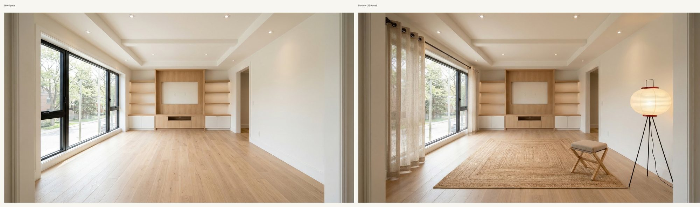

# Example1 Success Showcase

This folder keeps the **lightweight GitHub showcase** for:

`home space -> Amazon cart -> cart-only preview -> report project`

## Two Copies Strategy

- Full production output: `output/example1/`
  - keeps original images + full project + data
- Lightweight showcase (this folder): `showcase/example1-success/report-project/`
  - keeps only necessary images + report

## Preview

## Included (Lightweight)

- `report-project/REPORT.md`
- `report-project/images/01-base-space.jpg`
- `report-project/images/02-final-preview.jpg`
- `report-project/images/03-structure-compare.jpg`
- `report-project/manifest.json`

Open `report-project/REPORT.md` first.
