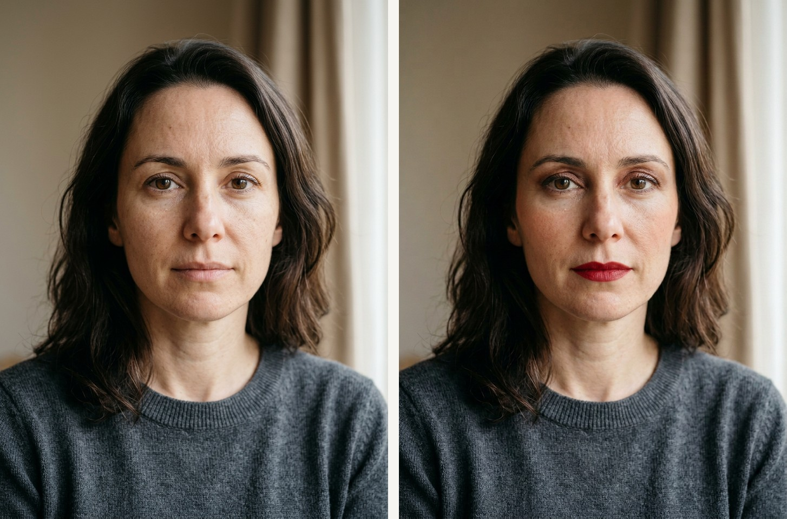

# 美妆方案报告（脸部）

## 1. 项目概览

- 目标网站：`Amazon`
- 风格目标：`Color-driven face makeup / 少量关键彩妆`
- 预算区间：`USD 24-55`
- 运行目录：`..`
- 报告目录：`.`

## 2. 空间诊断摘要

女性面部近景特写，适合通过少量关键彩妆（唇部+眼部+颊部）形成明确但自然的前后对比。

### 已确认信息
- 构图聚焦五官，嘴唇与眼皮区域清晰可见。
- 底妆较干净，适合叠加色彩型妆容变化。
- 背景简洁，可突出妆容本身。

### 关键假设
- 目标是可感知变化的日常妆，而非浓妆。
- 颜色以购物车中的口红和眼影主色为准。

## 3. 保留与新增策略

### 保留项
- 人物身份、五官结构与头部姿态。
- 镜头视角和背景环境。

### 立即购买
| 品类 | 购买理由 | 目标规格 | 搜索关键词 | 预算 |
|---|---|---|---|---|
| 口红 | 提供最直观的唇部颜色变化。 | 红色系, 哑光或丝绒质感, 显色稳定 | 口红, 简约风, 中性色 | USD 8-18 |
| 眼影盘 | 通过棕铜色眼妆增强眼部层次。 | 棕铜色, 哑光+珠光组合, 易晕染 | 眼影盘, 简约风, 中性色 | USD 10-22 |
| 腮红 | 补充面颊气色，让整体妆效更完整。 | 蜜桃色, 自然显色, 轻薄 | 腮红, 简约风, 中性色 | USD 6-15 |

### 延后购买
_无数据_

## 4. 购物车与真实商品图

### 购物车商品对照
| 商品 | 商品图 | 单价 | 数量 | 小计 | 商品链接 |
|---|---|---:|---:|---:|---|
| e.l.f. Primer-Infused Matte Blush, Long-Lasting, Lightweight & Buildable Powder Blush, Delivers A Matte Finish, Vegan & Cruelty-Free, Always Fresh |  | S$10.23 | 1 | S$ 10.23 | [打开商品](https://www.amazon.com/gp/product/B0CPFXDKYP/ref=ox_sc_act_image_1?smid=ATVPDKIKX0DER&psc=1) |
| ColourPop Nude Mood Eyeshadow Palette - Brown & Copper Palette with Metallic and Matte Finishes - High-Pigment Eye Makeup with a Long-Wearing Formula (0.3 oz) |  | S$17.91 | 1 | S$ 17.91 | [打开商品](https://www.amazon.com/gp/product/B089GBFM7G/ref=ox_sc_act_image_2?smid=A2EYNRV8VIDMHS&psc=1) |
| Maybelline Color Sensational Ultimatte Matte Lipstick, Non-Drying, Intense Color Pigment, More Ruby, Ruby Red, 1 Count |  | S$7.66 | 1 | S$ 7.66 | [打开商品](https://www.amazon.com/gp/product/B08H47F8Q3/ref=ox_sc_act_image_3?smid=A2VR0763PAH9T7&psc=1) |

### 购物车金额汇总
- 说明：金额取自购物车页面展示的真实价格（单价/数量/小计）。
- 商品小计合计（按条目计算）：`S$ 35.80`
- 购物车显示总额：`S$35.80`

### 购物车证据图

## 5. 效果图与结构一致性

| 原始空间 | 最终预览 |
|---|---|
|  |  |

### 生图约束
- 结构锁定：门/窗/墙/内置结构/视角保持不变。
- 商品约束：仅允许出现购物车商品（无额外新增物件）。

### 结构一致性对比图（门/窗/墙/视角）

### 商品参考板

## 6. 交付清单

- 报告：`REPORT.md`
- 图片目录：`images/`
- 数据目录：`data/`
  - `space-diagnosis.json`（若存在）
  - `cart-items-downloaded.json / cart-items-clean.json`（若存在）
  - `cart-summary.json`（若存在）
  - `cart-items-report.json`（规范化后）

---
本报告由 `build_home_report_project.py` 自动生成。
