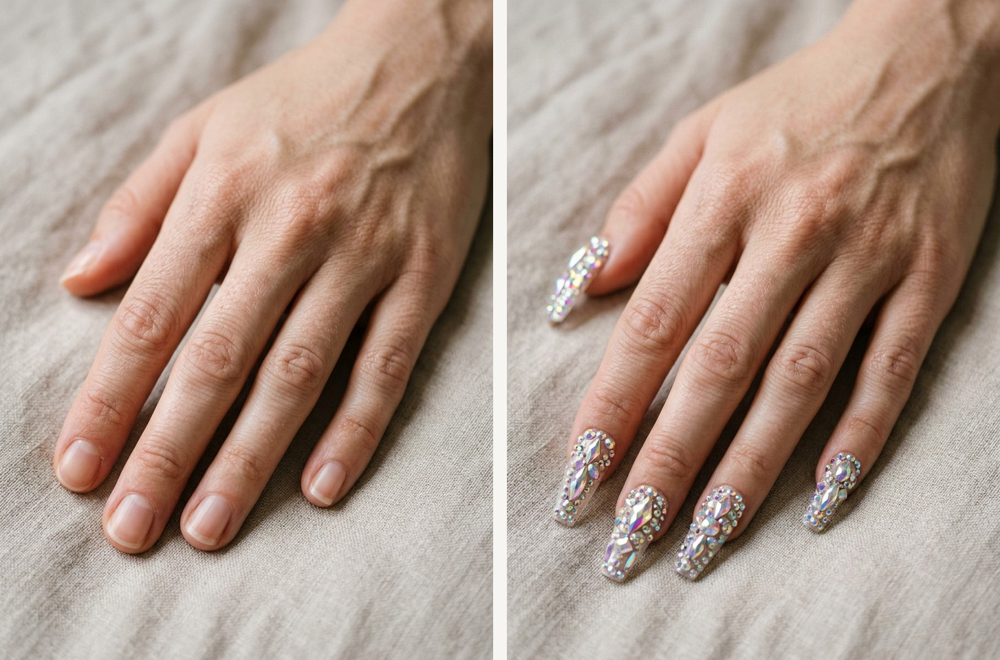

# 美妆方案报告（美甲）

## 1. 项目概览

- 目标网站：`Amazon`
- 风格目标：`Luxury rhinestone press-on nails / 宝石穿戴甲`
- 预算区间：`USD 8-16`
- 运行目录：`..`
- 报告目录：`.`

## 2. 空间诊断摘要

本次采用高戏剧性宝石穿戴甲单品方案，重点展示从自然短甲到长款水钻穿戴甲的强视觉跳变。

### 已确认信息
- 手部姿态稳定，适合突出甲面细节。
- 原始甲面较素，可承载高复杂度设计变化。
- 背景简洁，有助于强调宝石反光与甲型。

### 关键假设
- 目标是视觉冲击更强的展示效果。
- 造型严格参考购物车中宝石穿戴甲款式。

## 3. 保留与新增策略

### 保留项
- 手部结构、肤质和构图视角。
- 背景与光照关系。

### 立即购买
| 品类 | 购买理由 | 目标规格 | 搜索关键词 | 预算 |
|---|---|---|---|---|
| 宝石穿戴甲 | 单品即可实现最明显的前后对比。 | 长款 coffin 甲型, 3D 水钻/宝石装饰, 高光泽 | 宝石穿戴甲, 简约风, 中性色 | USD 8-16 |

### 延后购买
_无数据_

## 4. 购物车与真实商品图

### 购物车商品对照
| 商品 | 商品图 | 单价 | 数量 | 小计 | 商品链接 |
|---|---|---:|---:|---:|---|
| Luxurious 3D Crystal Press on Nails Long Coffin False Nails with Nail Glue Fake Nails With Rhinestones Designs Salon DIY Manicure Reusable Fake Acrylic Diamonds Nail Art Tips Gifts for Women 24Pcs |  | $9.99 | 1 | $ 9.99 | [打开商品](https://www.amazon.com/gp/product/B0CLG6HJQP/ref=ox_sc_act_image_1?smid=A1JY4TM25ZDN2M&psc=1) |

### 购物车金额汇总
- 说明：金额取自购物车页面展示的真实价格（单价/数量/小计）。
- 商品小计合计（按条目计算）：`$ 9.99`
- 购物车显示总额：`$9.99`

### 购物车证据图

## 5. 效果图与结构一致性

| 原始空间 | 最终预览 |
|---|---|
|  |  |

### 生图约束
- 结构锁定：门/窗/墙/内置结构/视角保持不变。
- 商品约束：仅允许出现购物车商品（无额外新增物件）。

### 结构一致性对比图（门/窗/墙/视角）

### 商品参考板

## 6. 交付清单

- 报告：`REPORT.md`
- 图片目录：`images/`
- 数据目录：`data/`
  - `space-diagnosis.json`（若存在）
  - `cart-items-downloaded.json / cart-items-clean.json`（若存在）
  - `cart-summary.json`（若存在）
  - `cart-items-report.json`（规范化后）

---
本报告由 `build_home_report_project.py` 自动生成。
